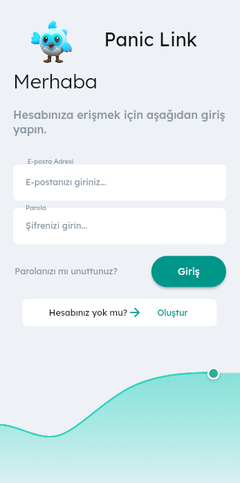
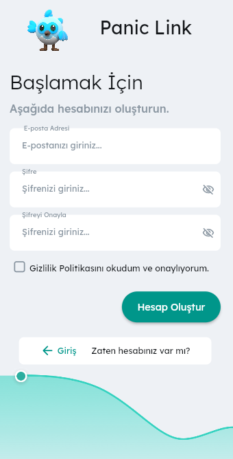
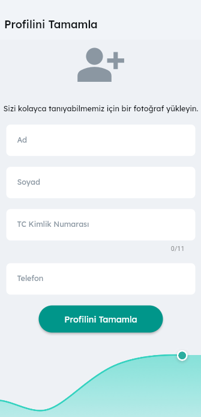
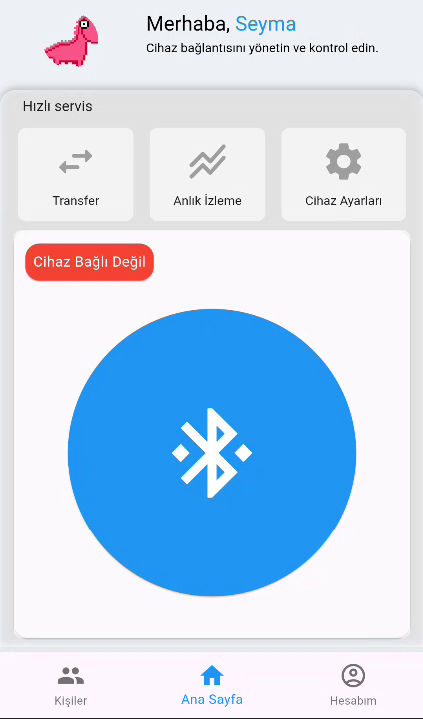
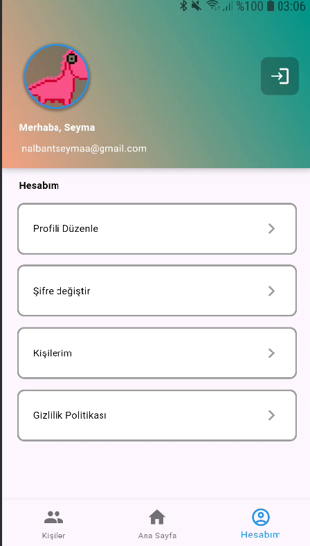
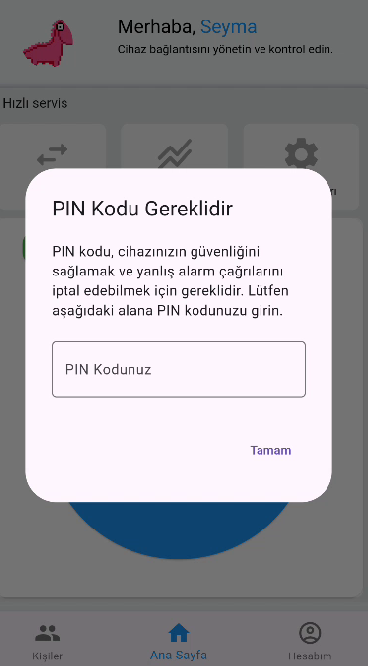
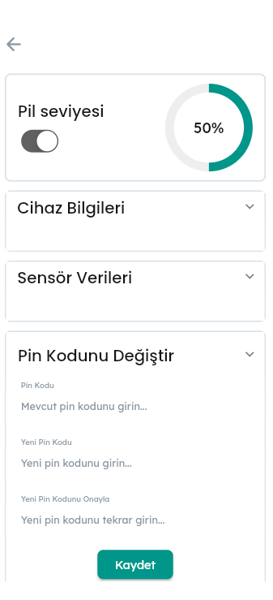
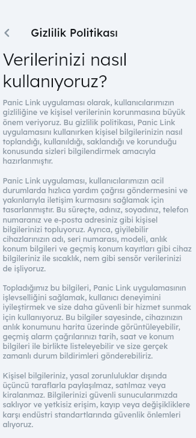

# Panic Link

Panic Link is an application that utilizes ESP32 and Bluetooth Low Energy (BLE) technologies to enable personal data transfer and emergency call functionality via a touch screen. The application is developed using Flutter and manages data through Firebase.

## Description

Panic Link allows users to make emergency calls and share personal data quickly using the ESP32 microcontroller and BLE technology. The application operates through a simple interface on a touch screen, enabling rapid communication of essential information in emergency situations.

## Features
- **Bluetooth Low Energy (BLE) Communication:** Provides secure and fast data transmission using ESP32 and BLE technology.
- **Personal Data Transfer:** Allows quick transfer of personal information to the ESP32 via the application.
- **Emergency Call:** Enables emergency calls through the touch screen.
- **Firebase Integration:** User data and device information are stored and managed using Firebase Realtime Database.
- **Flutter Application Development:** The application is developed with Flutter, ensuring cross-platform compatibility.
- **User-Friendly Interface:** Facilitates simple and fast operations with a user-friendly interface.
- **Visual Feedback:** Provides visual feedback on the screen for emergency calls and data transfer processes.

## Installation

### 1. Uploading Code to ESP32 with Arduino

1. **Install Arduino IDE:**
    - Download and install Arduino IDE from the [official site](https://www.arduino.cc/en/software).

2. **Add ESP32 Support:**
    - Open Arduino IDE.
    - Go to `File` > `Preferences`.
    - Add the following URL to the "Additional Board Manager URLs" field:
      ```
      https://dl.espressif.com/dl/package_esp32_index.json
      ```

3. **Select ESP32 Board:**
    - Go to `Tools` > `Board` > `Boards Manager`.
    - Search for "ESP32" and install it.
    - Select the appropriate ESP32 board from `Tools` > `Board`.

4. **Upload Code:**
    - Open the `yeni_kol.ino` file located in the `support_files` folder.
    - Click `Sketch` > `Upload` to upload the code to the ESP32 board.

### 2. Application Installation and Communication

1. **Download the Application:**
    - Clone or download the project from GitHub:
      ```bash
      git clone https://github.com/your_username/panic-link.git
      ```

2. **Install Dependencies:**
    - Navigate to the project directory:
      ```bash
      cd panic-link
      ```
    - Install the necessary dependencies:
      ```bash
      npm install
      ```

3. **Start the Application:**
    - Launch the application:
      ```bash
      npm start
      ```

4. **Firebase Configuration:**
    - Create a Firebase project and add the necessary configuration files to the application.
    - Manage data using Firebase Realtime Database and Authentication features.

5. **Communicate with ESP32:**
    - When the application starts, connect to the ESP32's BLE service.
    - Test the data transfer and emergency call features via the touch screen.

## Usage

After installation, you can transfer personal data and make emergency calls with a single touch through the application.

## Screenshots

Below are screenshots of the main screen and the emergency call screens:

<div style="display: flex; flex-wrap: wrap; gap: 10px;">
  
  
  
  
  
  
  
  
</div>

## Videos

The following videos demonstrate how to send data and make emergency calls via the touch screen:

- [Send Data](https://youtu.be/zgnWob2YGco)
- [Send and Cancel Emergency Call](https://youtube.com/shorts/RXpWckK4fc8)

## Contributing

1. Fork this repository
2. Create a new feature branch (`git checkout -b feature/feature-name`)
3. Make your changes and commit them (`git commit -am 'Add new feature'`)
4. Push your changes (`git push origin feature/feature-name`)
5. Create a pull request
